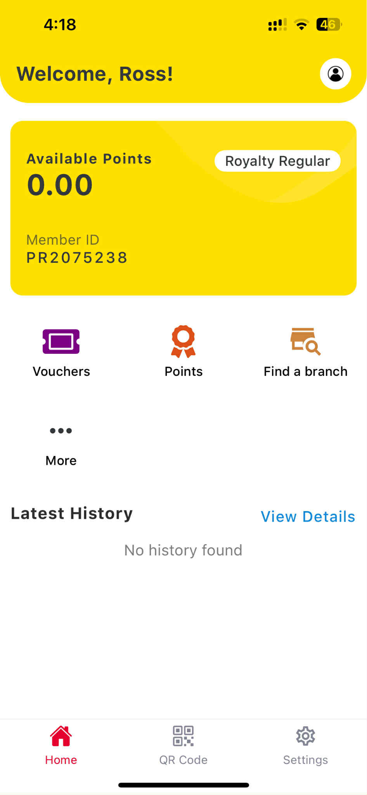

# 👋 Hi, I'm Ross Vincent C. Rabanos

🎯 **React Native Developer with 6+ Years of Experience**  
📍 Cebu, Philippines  
📧 [rabanos.rvc@gmail.com](mailto:rabanos.rvc@gmail.com)  
🔗 [LinkedIn](https://www.linkedin.com/in/ross-rabanos/) • [GitHub](https://github.com/baiross)

---

## 🛠️ Tech Stack

**Languages:** JavaScript, TypeScript, PHP, Kotlin, Java  
**Mobile:** React Native, Expo, Android Native  
**State Management:** Redux  
**Databases:** Realm DB, Firebase Firestore  
**Backend & APIs:** Node.js, REST  
**Tools:** Git, VS Code, Android Studio, Xcode

---

## 📱 Projects

### CLP
A mobile app for grocery and boutique stores that manages loyalty programs, letting customers earn points from purchases and gamification.  
Users can claim vouchers, and unique QR/barcodes are scanned by cashiers.  
The app syncs in real-time with the POS system for smooth tracking.

**Tech:** React Native, React Navigation, Redux, Redux-Saga, Firebase Cloud Messaging, Axios

---

### MedAlert
A React Native application used by doctors and secretaries in clinics to streamline patient management.  
Replaces manual processes by enabling digital storage of patient records, managing consultation queues, and generating medical certificates.  
Implemented LAN-based data syncing, fixed data migration issues, and ensured smooth offline-first performance using Realm.

**Tech:** React Native, React Navigation, Redux, Realm, react-native-tcp-socket, Axios

---

### BarterMobility
An Android app built for internal use at a grocery company, running on PDT devices.  
The app scans product barcodes to update item prices and prints updated barcodes, simplifying price adjustments and inventory management.

**Tech:** Android Native (Kotlin), Zebra Programming Language (ZPL), Zebra API for scanner configuration, OkHttp
